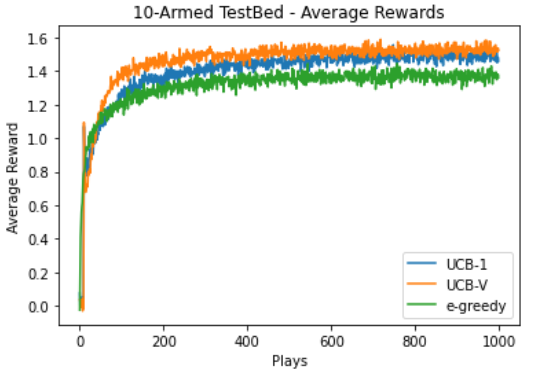
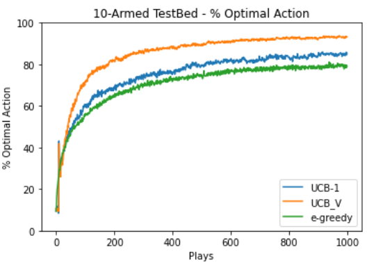
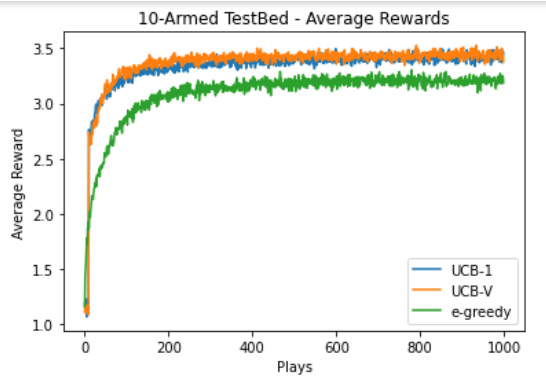
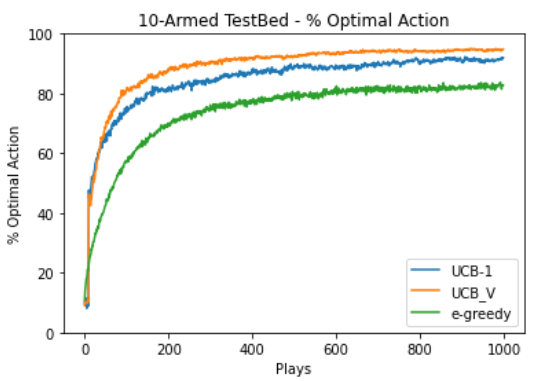

#  BTech Exploratory Project 
Under the guidance of [Dr. Lakshmanan Kailasam](https://www.iitbhu.ac.in/dept/cse/people/lakshmanankcse), IIT BHU

### Made with - 
    

### Submission Date : 10th May 2021
### __Team Members__
[Satya Prakash](https://github.com/sp-ps) : Roll No - 19075066  
[Nikita](https://github.com/n4i9kita) : Roll No - 19075048

Presentation Link - [PPT for Exploratory Project](https://docs.google.com/presentation/d/1nr8daElVh3E1s5hx3gytAdmx2nFKL5j-Mor7uHKVXtw/edit#slide=id.p1)
## Analysing  __Multi Armed Bandit Algorithms__ on different __Probability Distributions__
- Algorithms analysed : -greedy, UCB1 and UCBV 
- Probability Distributions : Normal and Heavy Tailed distributions

## What is a [multi armed bandit problem](https://en.wikipedia.org/wiki/Multi-armed_bandit) ?
> It is a classical reinforcement learning problem. 
To understand it, let us consider a situation where we have to select an arm out of the k-possibilities over a period of time, which have random reward values ( associated to the actions ) that is drawn from a probability distribution which is unknown. Our goal is to maximize the expected total reward obtained over a period of time.

## Motivation
There are many real life applications of multi armed bandit problem today like A/B testing of online advertisements, sequential portfolio selection, recommendation system used by digital platforms to offer personalized products to its users and  testing the effects of various medical treatments in clinical trials.  
As we can see from the above applications, the problem depends on creating a balance between __exploting__ the knowledge already obtained and __exploring__ the new actions, so as to increase our knowledge.

## Algorithms Implemented
### 1. -Greedy Algorithm :
It involves selecting the arm that has the highest mean reward with a probability of ( 1 -  ) - which is most of the time, and selecting any random arm with a probability of   any random arm out of all the possible arms with equal probability.
It is the most basic and easy to implement algorithm. 

### 2. UCB Family of Algorithms:
>As in the case of  -Greedy algorithm, all the arms are treated equally during exploration, and we might end up exploring a bad arm, which we had previously confirmed. 
>We would like to propose a solution that explores those arms that we are more uncertain about. 
>UCB algorithm tries to define the upper bound of the mean reward value
so that the actual value of the mean reward would always be less than the defined upper bound.
#### 3. __UCB1 Algoritm__ : 
Exploration term is defined as :   
The exploration factor is not entirely random but it is dependent upon __number of times an arm has been selected__ (  ) and __time steps__ (  ).    
In this case, expected cumulative regret grows logarithmically with time steps. Most of the regret occurs during the initial phase of exploration and after some time, it becomes nearly flat.
#### 4. __UCB3 Algorithm__ :
It is a modified version of -greedy algorithm.  
It selects the arm with highest mean reward with a probability of  and selects any random arm with a probability of .   
Unlike -greedy algorithm, in this case the exploration factor depends on the arm.   
 

#### 5. __UCBV Algorithm__ :
The uncertainity is caused by variance of the distribution.  
UCBV algorithm takes into account the factor of variance of the rewards in the exploration term. 
Exploration term in this case is defined as :   
An advantage of UCBV over other algorithms that do not involve sample variance is that the regret bound involves  instead of .  

## Experiment 1 :
__Dataset__ : Normal distribution with   and   
__K__ : 10  
__Total time steps__ : 1000  
__Number of times algorithm run__ : 2000  
We calculated the __average reward__ and __optimal action percentage__.  
Refer the graphs below :

Average rewards            |  Optimal action percentage
:-------------------------:|:--------------------------:
   |  

## Experiment 2 :
__Dataset__ : Heavy-tailed distribution with   
__K__ : 10  
__Total time steps__ : 1000  
__Number of times algorithm run__ : 2000  
We calculated the __average reward__ and __optimal action percentage__.  
Refer the graphs below :

Average rewards            |  Optimal action percentage
:-------------------------:|:--------------------------:
    |  

## Result :
From both the experiments we found out that UCBV performed better than UCB1 which performed better than -greedy algorithm.

## Conclusion : 
The report has clearly shown that the performance of these algorithms is similar on
normal and heavy-tailed distribution and does not depend on the true mean reward values of their arms.
So, we can clearly say that the relative behaviour of these algorithms will not change with change in the reward distribution of the data.

